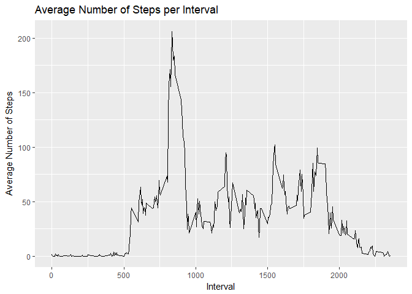

###Objective
The objective of this assignment is to answer a series of questions using data collected from a [FitBit](http://en.wikipedia.org/wiki/Fitbit).


###Loading Libraries and the data to be analyzed


```r
library("knitr")
library("markdown")
library("ggplot2")
library("plyr")
library(lattice)
movement <- read.csv("C:\\Users\\james\\OneDrive\\Documents\\Coursera\\Reproducible Research\\RepData_PeerAssessment1\\activity\\activity.csv")
```


###Cleaning data to removed missing values.


```r
clean <- movement[!is.na(movement$steps),]
movement$day <- weekdays(as.Date(movement$date))
movement$DateTime<- as.POSIXct(movement$date, format="%Y-%m-%d")
sumTable <- aggregate(movement$steps ~ movement$date, FUN=sum )
colnames(sumTable)<- c("Date", "Steps")
```

###Create the historgram of total steps per day

```r
hist(sumTable$Steps, breaks=10, xlab="Steps", main = "Total Steps per Day")
```

<!-- -->

###What are the mean and median total number of steps taken per day?

```r
movemean<-as.integer(mean(sumTable$Steps))
movemedian<-as.integer(median(sumTable$Steps))
```
The average total number of steps is 10766 and the median is 10765.

###What is the average daily activity pattern?
####Create average number of steps per interval

```r
intervalTable <- ddply(clean, .(interval), summarize, Avg = mean(steps))
```
####Create line plot of average number of steps per interval

```r
p <- ggplot(intervalTable, aes(x=interval, y=Avg), xlab = "Interval", ylab="Average Number of Steps")
p + geom_line()+xlab("Interval")+ylab("Average Number of Steps")+ggtitle("Average Number of Steps per Interval")
```

<!-- -->

```r
##Maximum steps by interval
maxSteps <- max(intervalTable$Avg)
##Which interval contains the maximum average number of steps
intervalTable[intervalTable$Avg==maxSteps,1]
```

```
## [1] 835
```
The maximum number of steps for a 5-minute interval was 206.1698113 steps.

The 5-minute interval which had the maximum number of steps was the 835 interval.

#### Imputing missing values
Calculate and report the total number of missing values in the dataset (i.e. the total number of rows with NAs)

```r
##Number of NAs in original data set
missing<-nrow(movement[is.na(movement$steps),])
```
The number of rows with missing data is 2304. Impute the missing values by substituting the missing steps with the average 5-minute interval based on the day of the week. Then create a new dataset that is equal to the original dataset but with the missing data filled in. 

```r
## Create the average number of steps per weekday and interval
avgTable <- ddply(clean, .(interval, date), summarize, Avg = mean(steps))
## Create dataset with all NAs for substitution
nadata<- movement[is.na(movement$steps),]
## Merge NA data with average weekday interval for substitution
newdata<-merge(nadata, avgTable, by=c("interval", "date"))
## Reorder the new substituded data in the same format as clean data set
newdata2<- newdata[,c(6,4,1,2,5)]
colnames(newdata2)<- c("steps", "date", "interval", "day", "DateTime")
##Merge the NA averages and non NA data together
mergeData <- rbind(clean, newdata2)
```
Next, we make a histogram of the total number of steps taken each day and Calculate and report the mean and median total number of steps taken per day.

```r
##Create sum of steps per date to compare with step 1
sumTable2 <- aggregate(mergeData$steps ~ mergeData$date, FUN=sum, )
colnames(sumTable2)<- c("Date", "Steps")
## Mean of Steps with NA data taken care of
imputedMean<-as.integer(mean(sumTable2$Steps))
## Median of Steps with NA data taken care of
imputedMedian<-as.integer(median(sumTable2$Steps))
```
The average total number of steps for imputed data is 10766 and the median is 10765.

```r
## Creating the histogram of total steps per day, categorized by data set to show impact
hist(sumTable$Steps, breaks=10, xlab="Steps", main = "Total Steps per Day with Missing Data Fixed", col="Grey")
legend("topright", c("Imputed Data"), fill=c("grey") )
```

<!-- -->

Since, for uncorrected data, the average total number of steps is 10766 and the median is 10765. And, the average total number of steps for imputed data is 10766 and the median is 10765, we can see that there is not a statistically significant difference between the original data and the data with imputed values.

### Are there differences in activity patterns between weekdays and weekends?

To begin, create a new factor variable in the dataset with two levels - “weekday” and “weekend” indicating whether a given date is a weekday or weekend day.


```r
## Create new category based on the days of the week
mergeData$DayCategory <- ifelse(mergeData$date %in% c("Saturday", "Sunday"), "Weekend", "Weekday")
```

Then, Make a panel plot containing a time series plot (i.e. type = “l”) of the 5-minute interval (x-axis) and the average number of steps taken, averaged across all weekday days or weekend days (y-axis).

```r
## Summarize data by interval and type of day
intervalTable2 <- ddply(mergeData, .(interval, DayCategory), summarize, Avg = mean(steps))

##Plot data in a panel plot
print(xyplot(Avg~interval|DayCategory, data=intervalTable2, type="l",layout=c(1,2),
       main="Average Steps per Interval Based on Type of Day", 
       ylab="Average Number of Steps", xlab="Interval"))
```

<!-- -->

A software problem in knitr is preventing the printing of the Weekend plot in the HTML file.

We find that  the step activity trends are different based on whether the day occurs on a weekend or not. This may be due to people having an increased opportunity for activity beyond normal work hours for those who work during the week.
